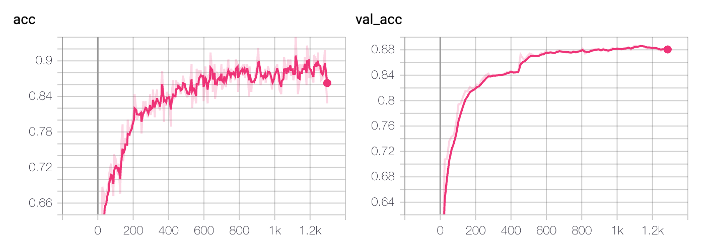

# Classify Financial Transactions
A package to classify financial transactions with a lightweight neural network. I use this to automatically categorize my spending between `common expenses` vs `personal`.   
This uses `pytorch` and [`pytorch-lighting`](https://pytorch-lightning.readthedocs.io/en/latest/)

## Let's look at the data
We'll use some financial transactions exported as csv with several useful fields.


```python
from models import TransClassifier, read_and_process_data, train_tokenizer, compute_features, prepair_training_dataset, \
    inspect
import pytorch_lightning as pl
from argparse import Namespace
from logging import getLogger
import torch
import os
from shutil import copyfile
device = "cuda" if torch.cuda.is_available() else "cpu"
```


```python
data = read_and_process_data("transactions_training_data.csv", after='2017-07-01')
data.head()
```

    INFO:root:0.32961435847683723


<table border="1" class="dataframe">
  <thead>
    <tr style="text-align: right;">
      <th></th>
      <th>Date</th>
      <th>Description</th>
      <th>Original Description</th>
      <th>Amount</th>
      <th>Transaction Type</th>
      <th>Category</th>
      <th>Account Name</th>
      <th>Labels</th>
      <th>Notes</th>
      <th>feature_string</th>
      <th>label</th>
      <th>feature_float</th>
      <th>weights</th>
    </tr>
  </thead>
  <tbody>
    <tr>
      <th>0</th>
      <td>2020-01-19</td>
      <td>LOYAL NINE</td>
      <td>LOYAL NINE</td>
      <td>22.47</td>
      <td>debit</td>
      <td>Coffee Shops</td>
      <td>CREDIT CARD</td>
      <td>NaN</td>
      <td>NaN</td>
      <td>coffee shops sunday credit card debit loyal nine</td>
      <td>False</td>
      <td>22.47</td>
      <td>1.0</td>
    </tr>
    <tr>
      <th>1</th>
      <td>2020-01-19</td>
      <td>LOYAL NINE</td>
      <td>LOYAL NINE</td>
      <td>12.20</td>
      <td>debit</td>
      <td>Coffee Shops</td>
      <td>CREDIT CARD</td>
      <td>NaN</td>
      <td>NaN</td>
      <td>coffee shops sunday credit card debit loyal nine</td>
      <td>False</td>
      <td>12.20</td>
      <td>1.0</td>
    </tr>
    <tr>
      <th>2</th>
      <td>2020-01-18</td>
      <td>Stop &amp; Shop</td>
      <td>STOP &amp; SHOP 0039</td>
      <td>13.68</td>
      <td>debit</td>
      <td>Groceries</td>
      <td>CREDIT CARD</td>
      <td>NaN</td>
      <td>NaN</td>
      <td>groceries saturday credit card debit stop &amp; sh...</td>
      <td>False</td>
      <td>13.68</td>
      <td>1.0</td>
    </tr>
    <tr>
      <th>3</th>
      <td>2020-01-17</td>
      <td>Liquor Junction</td>
      <td>LIQUOR JUNCTION-</td>
      <td>55.51</td>
      <td>debit</td>
      <td>Alcohol &amp; Bars</td>
      <td>CREDIT CARD</td>
      <td>NaN</td>
      <td>NaN</td>
      <td>alcohol &amp; bars friday credit card debit liquor...</td>
      <td>False</td>
      <td>55.51</td>
      <td>1.0</td>
    </tr>
    <tr>
      <th>4</th>
      <td>2018-03-21</td>
      <td>Lonestar Taqueria</td>
      <td>LONESTAR TAQUERIA</td>
      <td>14.16</td>
      <td>debit</td>
      <td>Restaurants</td>
      <td>CREDIT CARD</td>
      <td>NaN</td>
      <td>NaN</td>
      <td>restaurants wednesday credit card debit lonest...</td>
      <td>False</td>
      <td>14.16</td>
      <td>1.0</td>
    </tr>
  </tbody>
</table>


We'll concatenate a bunch of string fields into `feature_string`. We'll also use a numerical transaction `Amount` as a feature a well.


```python
data.loc[:,["feature_string","feature_float","label"]].head(5)
```


<table border="1" class="dataframe">
  <thead>
    <tr style="text-align: right;">
      <th></th>
      <th>feature_string</th>
      <th>feature_float</th>
      <th>label</th>
    </tr>
  </thead>
  <tbody>
    <tr>
      <th>0</th>
      <td>coffee shops sunday credit card debit loyal nine</td>
      <td>22.47</td>
      <td>False</td>
    </tr>
    <tr>
      <th>1</th>
      <td>coffee shops sunday credit card debit loyal nine</td>
      <td>12.20</td>
      <td>False</td>
    </tr>
    <tr>
      <th>2</th>
      <td>groceries saturday credit card debit stop &amp; sh...</td>
      <td>13.68</td>
      <td>False</td>
    </tr>
    <tr>
      <th>3</th>
      <td>alcohol &amp; bars friday credit card debit liquor...</td>
      <td>55.51</td>
      <td>False</td>
    </tr>
    <tr>
      <th>4</th>
      <td>restaurants wednesday credit card debit lonest...</td>
      <td>14.16</td>
      <td>False</td>
    </tr>
  </tbody>
</table>


## Tokenizer
Let's fit a subword tokenizer and convert the data to pytorch tensor dataset consisting of `string features, numerical features, labels, weights`


```python
train_tokenizer(data)
features_ids = compute_features(data)
dataset = prepair_training_dataset(features_ids, data)
dataset.tensors
```


    (tensor([[176, 208,  92,  ...,   0,   0,   0],
             [176, 208,  92,  ...,   0,   0,   0],
             [213, 576,  64,  ...,   0,   0,   0],
             ...,
             [201,  86, 199,  ...,   0,   0,   0],
             [196, 326,  92,  ...,   0,   0,   0],
             [139,  86, 165,  ...,   0,   0,   0]]),
     tensor([[22.4700],
             [12.2000],
             [13.6800],
             ...,
             [36.4700],
             [53.8700],
             [57.2200]]),
     tensor([0, 0, 0,  ..., 0, 1, 1]),
     tensor([1., 1., 1.,  ..., 1., 1., 1.]))


## Model
A lightweight 1D CNN based model to encode a string sequence. Define some hparams


```python
hparams = Namespace(gpus=1 if device == "cude" else None,
                        dropout_rate=.2,
                        hidden_dim=32,
                        batch_size=256,
                        seq_type="cnn",
                        max_epochs=100,
                        min_epochs=10,
                        progress_bar_refresh_rate=0,
                        best_model_path="model.ckpt")
```


```python
model = TransClassifier(hparams)
model
```


    TransClassifier(
      (emb): Embedding(1000, 32)
      (seq_encoder): Conv1d(32, 32, kernel_size=(3,), stride=(1,))
      (cont_lin): Linear(in_features=1, out_features=1, bias=True)
      (cls): Linear(in_features=33, out_features=2, bias=True)
      (drop): Dropout(p=0.2, inplace=False)
    )


## Traing
train using `pl`. using `tensorboard --logdir="./"`, we can inspect training at `localhost:6006`


```python
trainer = pl.Trainer(max_epochs=hparams.max_epochs,
                         min_epochs=hparams.min_epochs,
                         gpus=hparams.gpus,
                         progress_bar_refresh_rate=hparams.progress_bar_refresh_rate)

trainer.fit(model)
```



## Inspect

Let's see what our model got wront


```python
model = TransClassifier.load_from_checkpoint(trainer.checkpoint_callback.kth_best_model)
    _# check how model did_
with torch.no_grad():
    x_s, x_f, y, w = dataset.tensors
    out = model(x_s.to(device), x_f.to(device))
    probs = out[0].softmax(dim=1)[:, 1].cpu().numpy()
    
wrong = ((probs > .5) != data.label.values)
data["probs"] = probs
data["wrong"] = wrong
f"mean error {wrong.mean()}"
```


    'mean error 0.15110356536502548'


top false positives


```python
data.query("wrong").sort_values("probs").tail().loc[:,["Date", "Original Description", "Labels", "Amount", "probs"]]
```


<table border="1" class="dataframe">
  <thead>
    <tr style="text-align: right;">
      <th></th>
      <th>Date</th>
      <th>Original Description</th>
      <th>Labels</th>
      <th>Amount</th>
      <th>probs</th>
    </tr>
  </thead>
  <tbody>
    <tr>
      <th>970</th>
      <td>2019-06-04</td>
      <td>PETPOCKETBOOK</td>
      <td>NaN</td>
      <td>44.00</td>
      <td>0.958228</td>
    </tr>
    <tr>
      <th>2052</th>
      <td>2018-10-04</td>
      <td>Medford MA Utility ~ Tran: ACHDW</td>
      <td>NaN</td>
      <td>54.96</td>
      <td>0.962399</td>
    </tr>
    <tr>
      <th>1665</th>
      <td>2018-12-31</td>
      <td>WHOLEFDS MDF 10380</td>
      <td>NaN</td>
      <td>10.84</td>
      <td>0.970529</td>
    </tr>
    <tr>
      <th>1909</th>
      <td>2018-11-05</td>
      <td>Loyal Nine</td>
      <td>NaN</td>
      <td>31.25</td>
      <td>0.971103</td>
    </tr>
    <tr>
      <th>1617</th>
      <td>2019-01-11</td>
      <td>NAVEO CU ONLINE PMT 190111</td>
      <td>NaN</td>
      <td>178.58</td>
      <td>0.978446</td>
    </tr>
  </tbody>
</table>


top false negatives


```python
data.query("wrong").sort_values("probs").head().loc[:,["Date", "Original Description", "Labels", "Amount", "probs"]]
```


<table border="1" class="dataframe">
  <thead>
    <tr style="text-align: right;">
      <th></th>
      <th>Date</th>
      <th>Original Description</th>
      <th>Labels</th>
      <th>Amount</th>
      <th>probs</th>
    </tr>
  </thead>
  <tbody>
    <tr>
      <th>2129</th>
      <td>2018-09-23</td>
      <td>UBER TECHNOLOGIES INC</td>
      <td>Common</td>
      <td>23.84</td>
      <td>0.006179</td>
    </tr>
    <tr>
      <th>1072</th>
      <td>2019-05-12</td>
      <td>SQ *THE BACON TRUCK LLC</td>
      <td>Common</td>
      <td>29.21</td>
      <td>0.008110</td>
    </tr>
    <tr>
      <th>1318</th>
      <td>2019-03-17</td>
      <td>JETBLUE     2792607175535</td>
      <td>Common</td>
      <td>60.00</td>
      <td>0.010220</td>
    </tr>
    <tr>
      <th>4003</th>
      <td>2017-07-30</td>
      <td>Amazon.com</td>
      <td>Common</td>
      <td>43.55</td>
      <td>0.011140</td>
    </tr>
    <tr>
      <th>3463</th>
      <td>2017-11-26</td>
      <td>UBER   *TRIP 4FPFB</td>
      <td>Common</td>
      <td>16.17</td>
      <td>0.012539</td>
    </tr>
  </tbody>
</table>


